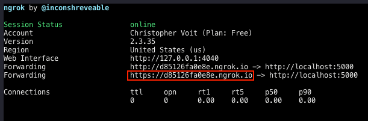

# WS2020/21 LMU Munich: Intelligent User Interfaces Project

### Alexa Skill
The Alexa Skill provides the user facing interaction with our service. It handles the voice in- and output and sends all relevant data to the backend for further processing. The skill is called 'Secret Santa' and can be invoked by saying: 'Alexa, start Secret Santa.'. Following the instructions provided by the Voice User Interface (VUI), the user answers a variety of questions filling the relevant 'Slots' of our ```GiftRecommendationIntent```. Every answer the user gives is checked for validity and ultimately forwarded to the backend.

##### Setup Steps
  1. Login to the [Amazon Developer Console](https://developer.amazon.com/alexa/console/ask?) with the credential provided in the submission
  2. You will find the Skill with the name 'IUIPrototyp'
  3. Clicking on it will allow you to get information about the Interaction Model, the sample utterances and the slots to be filled by the user.


### Backend
The backend handles all relevant data from the user. It reads the slot values coming from the Alexa Skill, cleans up the data, and orchestrates the data processing between the Recommender system, the NLP-Component and the Additional Filter. Lastly, it returns the relevant data back to the Alexa Skill.

##### Setup Steps
  1. Clone the code from our [Github](https://github.com/ChriAZi/ws2020-iui) using the credentials provided in the submission
  2. Once cloned place the ```.env``` file provided in the submission at the root folder of the project
  3. Install all necessary packages using pip 
```
pip install -r requirements.txt && pip install https://github.com/johnwheeler/flask-ask/archive/master.zip
```
 4. Go to [Ngrok](https://ngrok.com/), login with the credentials provided in the submission, to download their software and follow their setup process.
 5. Once finished, run the ```main.py``` file
 ```
python main.py
```
 6. Now run the ngrok service using the following command
```
./ngrok http 5000 
```
7. You should now have the python server running on ```localhost:5000```and the ngrok service bridging the connection to an http and an https server

8. Now, copy the HTTPS server-adress ending in ```ngrok.io```to your clipboard
9. Follow the Setup Process of the Alexa Skill described above and navigate to the 'IUIPrototyp'-Skill
10. In the left panel, click endpoint, choose HTTPS (if not already selected) and paste the copied link in the input field for default region
11. Choose the second option 'My development endpoint is a sub-domain...' in the drop down menu and click 'Save Endpoints' in the top left
12. You can now use the navigation menu in the [Amazon Developer Console](https://developer.amazon.com/alexa/console/ask/build/custom/amzn1.ask.skill.da234de1-7bf3-45e4-aa81-70cb64b00ea3/development/en_US/endpoint) to select the 'Test' Tab and interact with the skill using the invovation 'Start Secret Santa' 

### Additional Information
 - The backend only handles the absolut minimum of data to increase performance
 - It utilizes pre-built lookup-tables for the recommender-system and the sentiment-values
 - The needed CSV files are provided through an AWS-S3-Bucket
 - The actual code for the NLP and the Recommender-System can be found in the notebooks folder in the respective Python Notebooks
